<p align="center">
  
</p>

```txt
C:\Users\Carlos> type profile.txt

Login:       carlosdouradodev
Name:        Carlos Dourado
Role:        security-minded builder
Focus:       automation, OSINT, tooling, adversarial interfaces
Shell:       PowerShell, Python, TypeScript
Mode:        inspect assumptions, reduce blind spots, ship tools
```

`C:\Users\Carlos\focus`

```txt
C:\Users\Carlos> type focus.txt

[01] security tooling
[02] OSINT workflows
[03] automation for messy data
[04] adversarial interface design
[05] local systems inspection
```

`~/stack`

```txt
C:\Users\Carlos> dir runtime

Python
TypeScript
JavaScript
HTML
CSS
PowerShell
Laravel
```

`~/public`

```txt
C:\Users\Carlos> netstat -ano

80/tcp    amazonasfc       HTML interface
443/tcp   toque-os-bio     CSS signal layer
3000/tcp  testes           sandbox node
```

[amazonasfc](https://github.com/carlosdouradodev/amazonasfc) |
[toque-os-bio](https://github.com/carlosdouradodev/toque-os-bio) |
[testes](https://github.com/carlosdouradodev/testes)

```txt
C:\Users\Carlos> status

status: online
noise:  high
signal: filtered
```
