<p align="center">
  
</p>

```txt
carlos@github:~$ whoami
security-minded builder focused on automation, OSINT, and interfaces for low-trust systems
```

### ./focus

- security tooling
- OSINT workflows
- automation scripts
- adversarial interface design
- data extraction from messy sources

### ./stack

`Python` `TypeScript` `JavaScript` `HTML` `CSS` `PowerShell` `Laravel`

### ./public

- [amazonasfc](https://github.com/carlosdouradodev/amazonasfc)
- [toque-os-bio](https://github.com/carlosdouradodev/toque-os-bio)
- [testes](https://github.com/carlosdouradodev/testes)

```txt
carlos@github:~$ status
building small tools, inspecting assumptions, reducing blind spots
```
